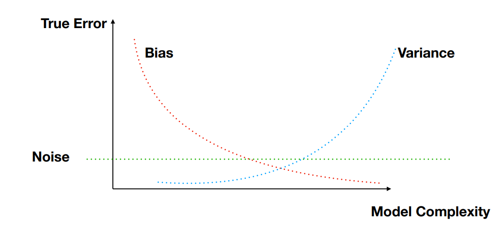

# Bias-variance decomposition

Bias and variance of the prediction considering that the input sample $S$ is a random variable

**Noise** → Strict lower bound, as independently random and impossible to predict (1st term)

**Bias** → how far off in general the model’s predictions are from the correct value (2nd term)

**Variance** → How much the predictions for a given point vary between realisations of the training set (3rd term)

$$
\mathbb{E}_{S\sim\mathcal{D}, \epsilon\sim\mathcal{D_\epsilon}}[(f(x_0)+\epsilon - f_S(x_0))^2] = \text{Var}_{\epsilon\sim\mathcal{D_\epsilon}}[\epsilon] \\ + (f(x_0) - \mathbb{E}_{S'\sim\mathcal{D}}[f_{S'}(x_0)])^2 \\ + \mathbb{E}_{S\sim\mathcal{D}}[(f_S(x_0) - \mathbb{E}_{S'\sim\mathcal{D}}[f_{S'}(x_0)])^2]
$$
