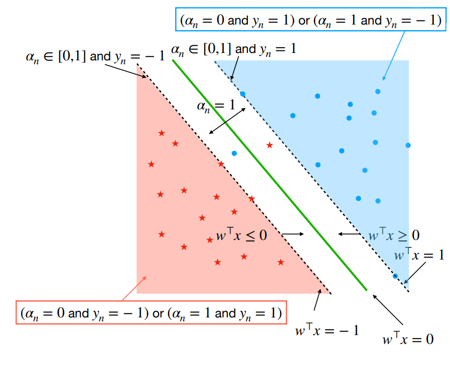

# Support vector machines (SVM)

We consider $y \in \{-1, 1\}$. Margin of a hyperplane $:= \min_{n \leq N} |w^\top x_n|$

## **Hard SVM** **- 3 equivalent formulations**

1. $\max_{w, ||w||=1} \min_{n \leq N} |w^\top x_n|$ such that $\forall n, y_n x_n^\top w \geq 0$
2. $\max_{M \in \R, w, ||w||=1} M$ such that $\forall n, y_n x_n^\top w \geq M$
3. $\min_w \frac{1}{2}||w||^2$ such that $\forall n, y_n x_n^\top w \geq 1$ → $M = \frac{1}{||w||}$

## Soft SVM - non linearly separable data

Maximise margin while allowing some constraints to be violated

$$
\min_w \frac{\lambda}{2}||w||^2 + \frac{1}{N}\sum_{n=1}^N[1-y_nx_n^\top w]_+
$$

$[z]_+ = \max(0, z)=\max_{\alpha \in [0,1]} \alpha z$. Continuous but non-smooth → subgradients

## Dual formulation

Define a function $G(w, \alpha)$ such that $\min_w \mathcal{L}=\min_w \max_\alpha G(w, \alpha)$. $G$ is *convex* in $w$ and *concave* in $\alpha$.

<u>Primal problem</u>: $\min_w \max_\alpha G(w, \alpha)$

<u>Dual problem</u>: $\max_\alpha \min_w G(w, \alpha)$

$$
\min_w \mathcal{L}(w) = \max_{\alpha \in [0,1]^n} \alpha^\top 1 - \frac{1}{2 \lambda N} \alpha^\top \mathbf{YXX}^\top\mathbf{Y}\alpha
$$

where $w(\alpha)=\frac{1}{\lambda N} \mathbf{X}^\top\mathbf{Y}\alpha$ and $\mathbf{Y} = \text{diag}(\mathbf{y})$. $\mathbf{YXX}^\top\mathbf{Y}$ is psd and only depends on kernel matrix.

- $\alpha_n = 0$ if $x_n$ is on the right side, outside of the margin ($1-y_nx_n^\top w < 0)$
- $\alpha_n \in [0,1]$ if $x_n$ is on the right side and on the margin ($1-y_nx_n^\top w = 0)$
- $\alpha_n = 1$ if $x_n$ is on the inside the margin or on the wrong side ($1-y_nx_n^\top w > 0)$
- Points for which $\alpha_n > 0$ are called **support vectors** (model only depends on support vectors)

$$
w=\frac{1}{\lambda N} \sum_{n=1}^N\alpha_n y_n x_n
$$

