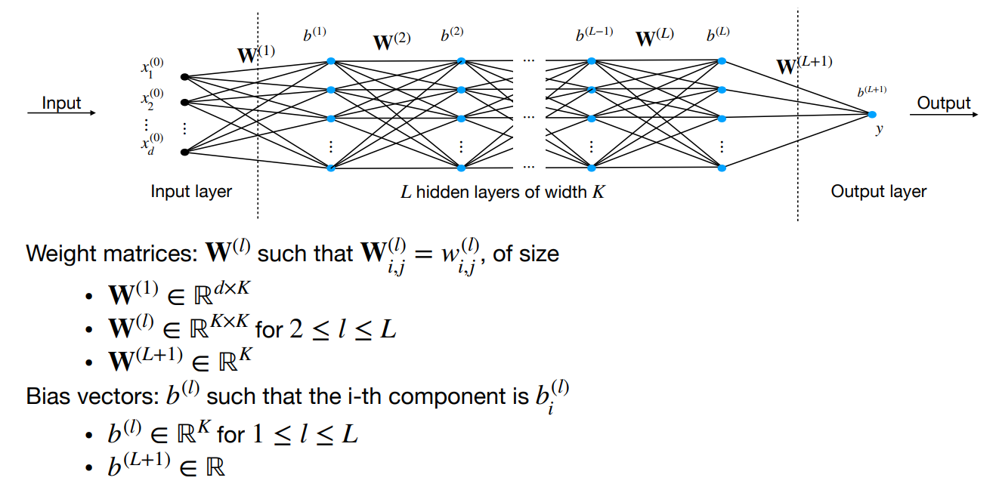
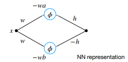
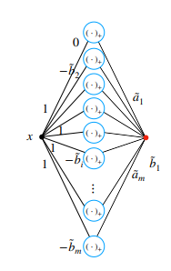

# Neural Networks

Learn non-linear function $f_{NN}(x)$ to transform $x$ into a good feature representation for predictions.

## Multi-layer perceptron (MLP) structure

Network with $L$ hidden layers with $K_L$ neurons each. The output of hidden layer $l$ is   $x^{(l)}=f^{(l)}(x^{(l-1)}):=\phi((\mathbf{W}^{(l)})^\top x^{(l-1)}+b^{(l)})$, where the weights $\mathbf{W}^{(l)}$ and biases $b^{(l)}$ are learnable → $\mathcal{O}(K^2L)$ learnable parameters. The global function $y=f(x^{(0)})$ is the composition $f=f^{(L+1)} \circ f^{(L)} \circ ... \circ f^{(1)}$

- **Inference**: $h(x) = f(x)^\top w^{(L+1)}+b^{(L+1)}$
  - Regression → $h(x)$
  - Binary classification with $y\in \{-1,1\}$ → $\text{sign}(h(x))$
  - Multi-Class classification $y\in \{1,...,K\}$ → $\text{arg} \max_{c\in \{1,...,K\}}h(x)_c$
- **Training**
  - Regression → $\mathcal{L}(y,h(x))=(h(x)-y)^2$
  - Binary classification with → $\mathcal{L}(y,h(x))=\ln(1+\exp(-yh(x)))$
  - Multi-Class classification → $\mathcal{L}(y,h(x))=-\ln(\frac{e^{h(x)_y}}{\sum_{i=1}^K e^{h(x)_i}})$
- **Activation functions**:  sigmoid  $\phi(x) = \sigma(x)$, ReLU $\phi(x) = [x]_+ = \max\{0, x\}$, GeLU $\phi(x) \approx x\cdot\sigma(1.702x)$

## Representation power

- All sufficiently smooth function can be approximated by a one-hidden-layer NN ($l_2$ norm):  $\int_{|x|\leq r} (f(x)-f_n(x))^2dx\leq\frac{(2Cr)^2}{n}$, $C$→ the smaller, the smoother $f$
- A NN with sigmoid activation and at most two hidden layers can approximate well a smooth function in $l_1$-norm
  1. Approximate the function integral in the Riemann sense by a sum of $k$ rectangles
  2. Represent each rectangle using two nodes in the hidden layer of a neural network  $h(\phi(w(x-a))-\phi(w(x-b)))$

     
  3. Compute the sum of all nodes in the hidden layer (considering appropriate weights and signs) to get the final output → NN with one hidden layer containing $2k$ nodes for a Riemann sum with  $k$ rectangles
- $l_\infty$ approximation result: $f$ continuous on $[c,d]$. $\forall \epsilon \geq0$, it exists piecewise linear (pwl) continuous $q$ such that $\sup_{x\in[c,d]} |f(x)-q(x)| \leq \epsilon$
  1. pwl $q$ can be written as combination of ReLU $q(x)=\tilde a_1x+\tilde b_1 + \sum_{i=2}^m \tilde a_i(x-\tilde b_1)_+$
  2. $q$ can be implemented as a one-hidden-layer NN with ReLU activation

  

## Training (SGD) - Backpropagation

Searching $\min_{w_{i,j}^{(l)}, b_i^{(l)}} \mathcal{L}(f)$ using SGD→ non-convex

**Forward pass**: $\mathcal{O}(K^2L)$

- $x^{(0)}=x_n \in \R^d$
- $z^{(l)}=(\mathbf{W}^{(l)})^\top x^{(l-1)}+b^{(l)}$
- $x^{(l)} = \phi(z^{(l)})$

**Backward pass**: $\mathcal{O}(K^2L)$

- $\delta^{(L+1)} = z^{(L+1)}-y_n$
- $\delta^{(l)}=(\mathbf{W}^{(l+1)}\delta^{(l+1)}) \odot \phi'(z^{(l)})$

**Derivatives**:

- $\frac{\partial \mathcal{L}_n}{\partial w_{i,j}^{(l)}} = \delta_j^{(l)}x_i^{(l-1)}$
- $\frac{\partial \mathcal{L}_n}{\partial b_j^{(l)}} = \delta_j^{(l)}$

**Parameter initialisation**: vanishing/exploding gradient → **He** initialisation. For ReLU networks, initialise weights as $\mathcal{N}(0, \sqrt{2/K} \cdot \mathbf{I}_K)$

**Normalisation layers**: dynamically stabilise training process → faster convergence

- <u>Batch normalisation</u>: $\bar z_n^{(l)}= \frac{z_n^{(l)}-\mu_B^{(l)}}{\sqrt{(\sigma_B^{(l)})^2+\epsilon}}$ ($\epsilon \approx 0$ for numerical stability) Learnable parameters to reverse normalisation:  $\hat z_n^{(l)}=\gamma^{(l)} \odot \bar z_n^{(l)}+ \beta^{(l)}$

  Prediction should not depend on batch → estimate $\hat \mu = \mathbb{E}[\mu]$ and $\hat \sigma = \mathbb{E}[\sigma]$ and use for inference. Requires sufficiently large batches for good approximations

- <u>Layer normalisation</u>: Same but summing over $K$ to get $\mu$ and $\sigma$ Batch independent → use same normalisation for training and inference

## Convolutional nets

Image size $W\times H$. Convolution $x_{n,m}^{(1)}=\sum_{k,l}f_{k,l}\cdot x_{n-k,m-l}^{(0)}$ where $f$ is a local filter with learnable weights. $x_{n,m}^{(1)}$ only depends on values of $x^{(0)}$ close to $(n,m)$ → sparsely connected

- <u>Padding</u>: for borders, use zero padding or valid padding (reduces dimensionality)
- <u>Multiple channels</u>: possible to use $C$ channels (filters) on one input
- <u><u><u><u><u><u><u>Pooling</u></u></u></u></u></u></u>: down-sampling
  - **max pooling**: returns max value of feature portion covered by kernel
  - **average pooling**: returns average value of feature portion covered by kernel
- <u>Hyperparameters</u>: pooling/convolution size/type/stride. Generally: $W,H \searrow$ and $C \nearrow$
- <u>Weight sharing</u>: back-propagation ignoring weights are shared and summing gradients of edges sharing weights

## Regularisation

**Residual networks**: skip connections around some layers $\mathbf{Y}=R(\mathbf{X})+\mathbf{X}$: lower training loss

**Data augmentation**: generate new data with same labels by corrupting existing data → robust

**Weight decay**: $l_2$ regularise weights without regularising biases. No direct regularisation effect (scale invariance) but training dynamics differ

**Dropout**: at each training step, retain nodes in layer $(l)$ with probability $p^{(l)}$ and scale by $p^{(l)}$ (for inference, where all nodes are used). Variance not preserved! → works poorly with normalisation
