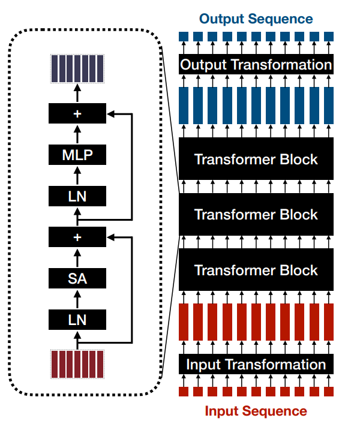

# Transformers

Transformer $f:sequence \rightarrow sequence$. Applicable across any modality (everything can be a token), good for long-range dependencies in text, self-attention scales quadratically but highly parallelisable

## Input Transformations

$Input \rightarrow tokens \in \R^D$

- for each word in text→ token ID → vector in $\R^D$
- for each patch in image → flatten $\in \R^{F}$ → multiply by embedding matrix $\mathbf{W} \in \R^{F\times D}$

## Transformer block

$tokens \in \R^D \rightarrow tokens \in \R^D$

- **Attention**: $A:tokens \rightarrow tokens$
  - Query tokens $Q \in \R^{T_{out}\times D_K}$  Key tokens $K \in \R^{T_{in}\times D_K}$
  - mixes info between tokens ~ weighted average with weights $p_{i,j}$ based on how similar $q_i$ and $k_j$ are: $P=\text{softmax}\left(\frac{QK^\top}{\sqrt{D_K}}\right)$, where $\text{softmax}(\mathbf{x})_i=\frac{e^{x_i}}{\sum_j e^{x_j}}$
- **Self-Attention**: $T=T_{in}=T_{out}$, $X\in \R^{T \times D}$
  - Queries $Q = XW_Q \in \R^{T\times D_K}$  Keys $K = XW_K\in \R^{T\times D_K}$  Values $V = XW_V\in \R^{T\times D}$
  - Output $Z=\text{softmax}\left(\frac{X W_Q W_K^\top X^\top}{\sqrt{D_K}}\right) X W_V = \text{softmax}\left(\frac{QK^\top}{\sqrt{D_K}}\right) V$
  - Run $H$ self-attention heads in parallel and linearly combine the outputs
- **MLP**: mixes information within tokens $\text{MLP}(X)=\varphi(XW_1)W_2$ ← learned $W$
- **Other blocks**: Layer Normalisation, Skip connections + add positional embedding!

## Output Transformations

$tokens \in \R^D \rightarrow output$

- Simple: linear or small MLP, task dependent (classification/multiple outputs)
