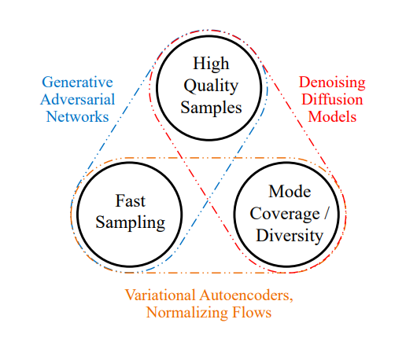
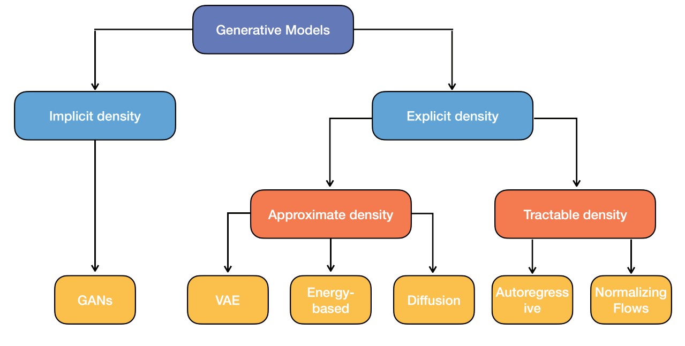
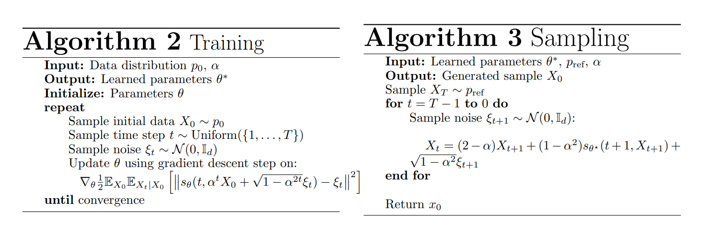

# Generative Models

Creates more form the learned distribution $p(x)$. *Explicit* → learn distribution. *Implicit* → only generating samples according to distribution.

**Generative Adversarial Networks**: Create images from known noise distribution $p_z$. 2-player game: generator $G(\theta)$ vs. discriminator $D(\varphi)$ (deep NNs). $T$ steps gradient descent for steps

1. $\varphi^*\in\text{arg} \min_{\varphi \in \Phi} \mathcal{L}^\varphi(\theta^*, \varphi)$ → distinguishes real ($x \sim p_d$) vs. generated images $G(z)$
2. $\theta^*\in\text{arg} \min_{\theta \in \Theta} \mathcal{L}^\theta(\theta, \varphi^*)$ → creates realistic images $G(z)$
3. Objective: $\min_G \max_D \mathbb{E}_{x \sim p_d}[\log D(x)] + \mathbb{E}_{z \sim p_z}[\log (1-D(G(z)))]$
4. Theoretical solution: optimum when $p_g = p_d$ with value $- \log4$

→ **Conditional GAN (CGAN)**: additional information $c$ (e.g. class labels)

**Diffusion models**: forward decomposition → add noise, backward decomposition → undo noise Use ancestral sampling starting from a pure Gaussian noise and denoising using Markov chain. Often use U-net architecture (with exponential moving average to stabilise training) with ResNet blocks and self-attention layers. To add additional information $y$ (conditional training), the probabilities of neural net $s_\theta$ should be conditional on $Y$.

